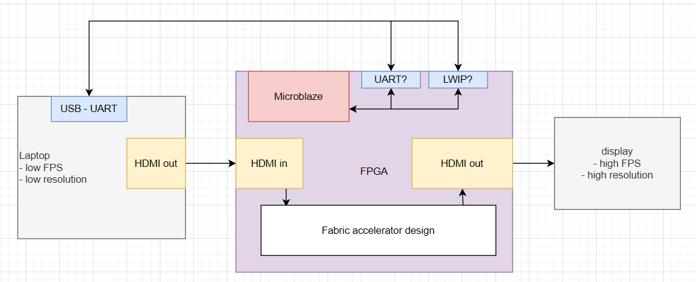
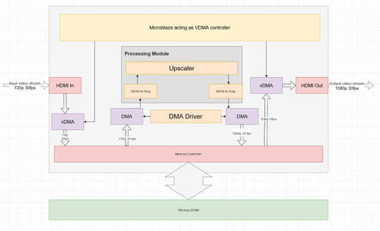

# FPGA Upscaler

ECE532 spring 2023 - digital systems design, group 2
University of Toronto

Benjamin Cheng
Jay Mohile
Leo Han
Yong Da Li

## Initial Goals

Our initial goals were to implement both frame interpolation (for generating additional frames and increasing video frame rate) and resolution upscaling. The target input resolution and frame rate was 24-bit colour 720p (1280 px by 720 px) at 30 frames-per-second (FPS) and the target output resolution was 24-bit colour 1080p (1920 px by 1080 px) at 60 FPS.

### Initial Block Diagram



## Re-scoped Goals

As we got close to a final implementation, we hit DDR bandwidth limitations that made frame interpolation infeasible. Although our hand-calculations showed sufficient bandwidth, we hadn't accounted for non-idealities due to contention, timing requirements, etc.

This caused us to rescope and drop frame-interpolation from the final system (though much of the required infrastructure had already been built).

### Final Block Diagram



## Directory Structure

Complete verilog source code is in `src/vivado`. Libraries (ex. board files) are in `src/vivado-library` Since we Vivado HLS, the files for that are in the `src/dma_driver_hls`. The `src/integrated_upscaling` contains the code used for the final project. The other folders in `src/` are intermediate snapshots of progress

```
.
├── docs
├── images
├── misc
├── src
│   ├── dma_driver_hls
│   ├── dma_passthrough
│   ├── hdmi_inout
│   ├── integrated_upscaling
│   ├── vivado
│   └── vivado-library
└── utils
    └── image
```

## How to use - Development Environment

Vivado is a bit hard to use with Git, but fortunately, it is very tightly integrated with TCL. The following is a high level description of how we version control our project, followed by specific checklists for common actions.

We keep our sources external to vivado. All design sources (hdl modules and block designs) go in src/(hdl or bd) respectively. Constraints and other utilities go in constraints, utils.

In general, this is all we check into version control. Tentatively, we are also checking in project.tcl...but I'm not sure about this longterm.

## Development Process

### Pulling in Upstream Work

1. Run a git pull on the terminal, resolve any conflicts (specifically with `project.tcl`)
2. Open Vivado, don't open a specific project.
3. Tools > Run TCL > `vivado/scripts/init_project.tcl`
   - Note: this will delete your vivado project and recreate it. If you have outstanding work or configuration changes, don't do this until you've exported them.
4. Now you can use the project in Vivado.

### Exporting Work

1. Check in all of your changes to the block diagrams, hdl, etc, normally.
2. If you are sure you did not change any project-level configuration...that's it.
   - Note: I have no idea how to be sure of this.
3. Otherwise, with Vivado opened to your project: Tools > Run TCL > `vivado/scripts/export_project.tcl`
4. Check in the changed `project.tcl`, and push up to git.

### Notes

0. bits
1. colors (N bits in a color)
2. pixels (3 colors in a pixel, RGB)
3. cells --> input for the upscaler, hard-coded for 720 -> 1080 (aka 2x2 to 3x3)
4. chunks --> handle 1 chunk in parallel
   1. instantiates enough cells to do it
5. frames
